#:computer: How to Run .jar
```ruby
cd Vocab-Game\core\assets
java -jar VocabGame.jar path
```
เช่น
```ruby
cd C:\Project\Vocab-Game\core\assets
java -jar VocabGame.jar C:\Project\Vocab-Game
```

# Vocab-Game เกมส์ทายความหมายศัพท์ภาษาอังกฤษ

## คำอธิบายโปรเจค
&nbsp;&nbsp;&nbsp;&nbsp;&nbsp;&nbsp;&nbsp;&nbsp;ปัจจุบันภาษาอังกฤษมีความสำคัญเป็นอย่างมาก เพราะเป็นภาษาสากลที่ทั่วทั้งโลกใช้ในการติดต่อสื่อสารกันในหลาย ๆ ด้าน โดยภาษาอังกฤษประกอบไปด้วยหลายทักษะ เช่น การฟัง การอ่าน การพูด และการเขียน ซึ่งสามารถฝึกฝนได้ผ่านสื่อที่หลากหลาย นอกจากนี้กุญแจสำคัญที่ทำให้ภาษาอังกฤษสามารถเรียนรู้ได้ง่ายขึ้นนั่นคือ “คำศัพท์” หากเรารู้คำศัพท์มาก เราจะสามารถตีความ หรือรู้ความหมายได้ง่ายขึ้น ซึ่งส่งผลต่อทักษะด้านต่าง ๆ ของภาษาอังกฤษ หากเรามีการฝึกฝนทางด้านคำศัพท์มาตั้งแต่เด็กก็จะเป็นการปูพื้นฐานภาษาอังกฤษที่ดี ดังนั้นความรู้เรื่องคำศัพท์จึงเป็นเรื่องสำคัญในการเรียนรู้ภาษา โดยพวกเราได้จัดทำเกมทายคำศัพท์ภาษาอังกฤษขึ้นมา เพื่อเป็นสื่อเรียนรู้ในการฝึกฝนด้านคำศัพท์ภาษาอังกฤษ และให้ผู้ที่กำลังฝึกฝนทางด้านภาษาอังกฤษเกิดความสนุก และไม่เครียดกับการฝึกฝนด้วยตนเอง นอกจากนี้ผู้เล่นจะสามารถจดจำคำศัพท์ภาษาอังกฤษได้มากขึ้น

## วัตถุประสงค์ และเป้าหมาย
1.	เพื่อให้ผู้เล่นเกมสามารถจดจำคำศัพท์ภาษาอังกฤษได้มากขึ้น
2.	เพื่อให้ผู้เล่นได้รับความสนุกสนาน และเพลิดเพลินขณะเล่นเกมส์
3.	เพื่อให้ผู้เล่นทราบถึงคำศัพท์ระดับพื้นที่ควรรู้ในภาษาอังกฤษ
4.	เพื่อให้ผู้เล่นได้ฝึกกระบวนการความคิด และสมอง

## ประโยชน์ที่คาดว่าจะได้รับ และการนำไปใช้
1.	สามารถนำเกมส์ไปเป็นสื่อการในการเรียนรู้ทางด้านภาษาอังกฤษได้
2.	ผู้เล่นรู้สึกสนุกกับเกมส์ และไม่รู้สึกเบื่อหน่ายขณะเรียนรู้ภาษาอังกฤษ
3.	ผู้เล่นกระตือรือร้นในการเรียนรู้ทางด้านภาษาอังกฤษ

## ขอบเขต และข้อจำกัดของโปรแกรมที่จะพัฒนา
1.	ผู้เล่นสามารถเลือกได้ว่าจะตอบผิดกี่ครั้ง โดยมีให้เลือกไม่เกิน 1 - 5 ครั้ง ก่อนจะบังคับจบเกมส์
2.	สามารถนำไปใช้เป็นสื่อการสอนในระดับประถมศึกษา มัธยมศึกษาได้ หรือผู้ที่สนใจ
3.	สามารถเล่นได้ 1 คน ต่อเกม
4.	ผู้เล่นสามารถเลือกตอบได้จากตัวเลือกทั้ง 4 ตัวเลือก
5.	ผู้เล่นสามารถเลือกเวลาได้โดยมีให้เลือกได้ 10 – 30 วินาที ต่อหนึ่งข้อ
6.	คำถามอ้างอิงตาม Database เราสามารถ Random ได้
7.	ใน 1 เกม จะมีคำถามให้เลือกได้ว่าจะทำกี่ข้อโดยมีให้เลือก 10 - 40 ข้อ
8.	เสียงคำอ่านของศัพท์นั้น ๆ ในบางคำอาจฟังไม่รู้เรื่อง หรือเป็นสำเนียงที่ไม่ใช่สำเนียงของศัพท์นั้น ๆ
9.	สามารถเลือกได้ว่าจะดูเฉลยได้ หรือเลือกที่จะปิดเฉลยไว้แล้วไปค้นหาเองได้
10.	สามารถปรับระดับเสียงเพลงประกอบขณะเล่นได้
11.	Font ที่แสดงผลเป็นภาษาไทย อาจจะมีบางตัวอักษรที่ไม่สามารถแสดงผลตามที่ต้องการได้

## Storyboard
ขั้นตอนการเปิดเกมส์มีดังนี้
- กด Import หลังจาก Clone จาก Git เสร็จ (เปิดโดยใช้ Eclipse)<br> 
 <a href="">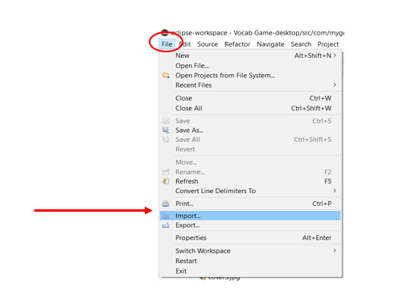</a>
- กดเลือก Existing Gradle Project ตามด้วยปุ่ม Next<br>
 <a href="">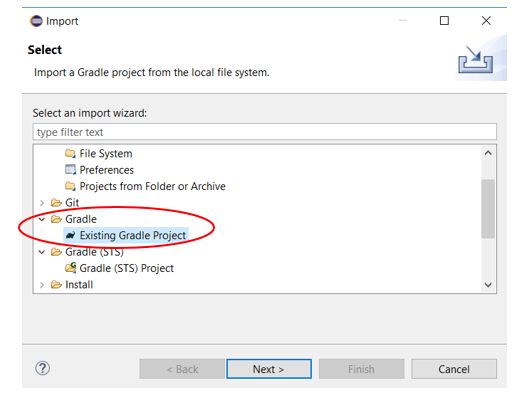</a>
 <a href="">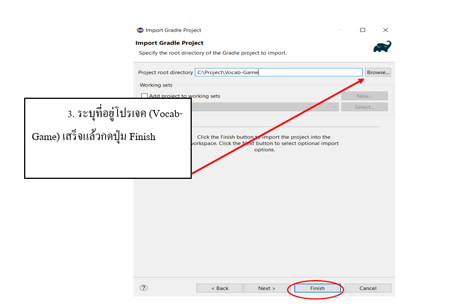</a>
- ไปที่ Vocab-Game-desktop จากนั้นกดที่โฟลเดอร์ของเกมส์ แล้วเลือก DesktopLauncher.java คลิกขวาแล้วเลือก Run As เสร็จแล้วก็เลือก Run Configurations<br>
<a href="">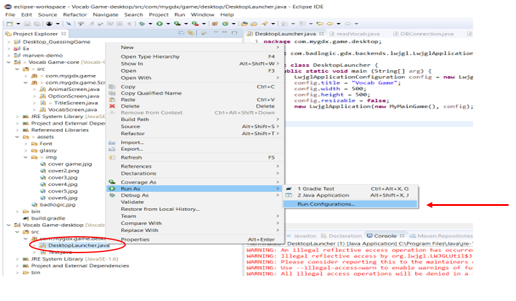</a>
- ทำตามขั้นตอนที่ชี้ตามลูกศร คือ 1. กดเลือกที่ Arguments   2. กดเลือก Workspace    3. เลือก Assets ที่ Vocab Game-core  4. กด OK <br>
<a href="">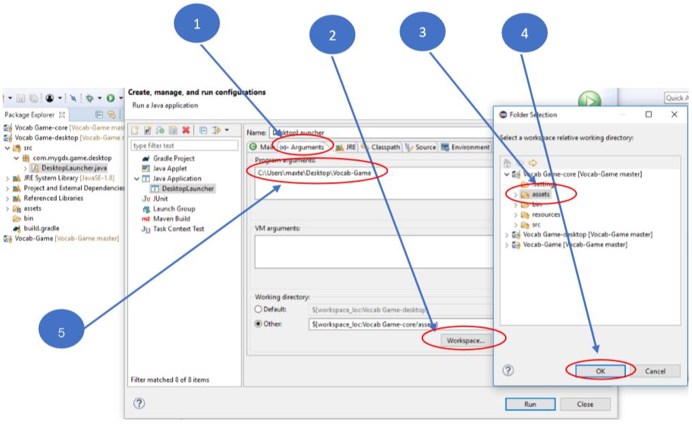</a>
- จากนั้นเข้าไปที่โฟลเดอร์โปรเจค (Vocab-Game) แล้วทำการกด shift + คลิกขวา และคลิก Open PowerShell window here <br>
<a href="">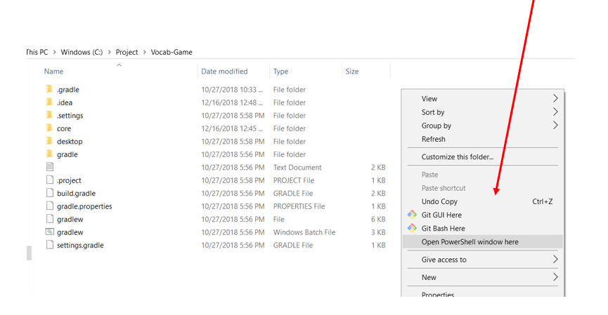</a>
- พิมพ์คำสั่ง pwd จากนั้นนำค่าที่ได้ไปใส่ใน Program arguments ซึ่งเป็นการระบุที่อยู่ของโปรเจค เพื่อที่จะสามารถเข้าถึงฐานข้อมูลได้ (ไมโครซอฟท์ แอ็คเซส) โดยฐานข้อมูลจะอยู่ที่ Vocab-Game\core\assets\vocab <br>
<a href="">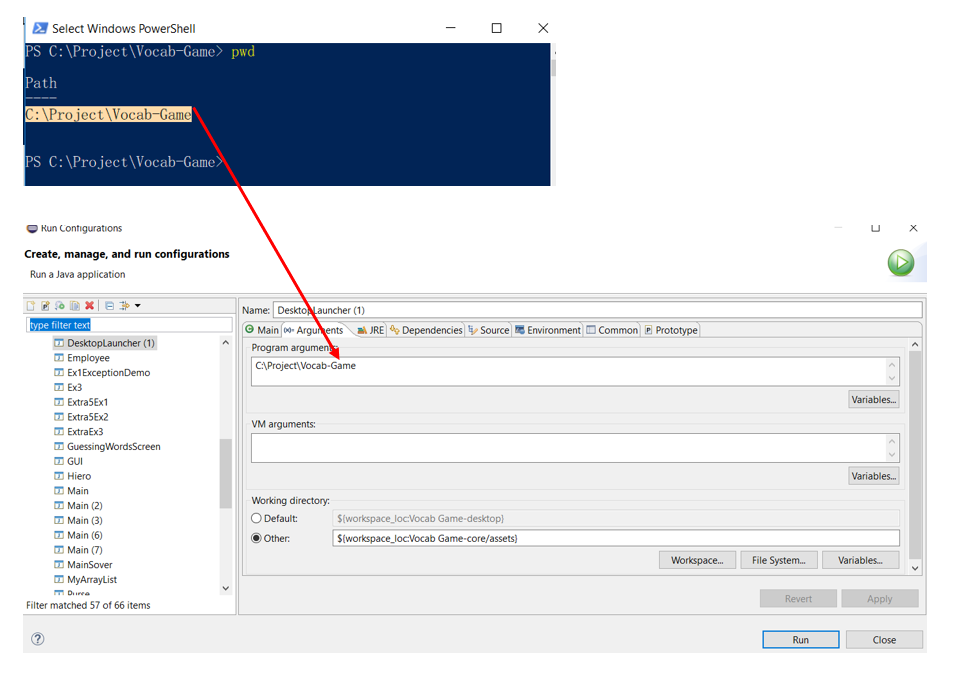</a>
- จากนั้นกดเลือก Properties ที่ Vocab Game-core <br>
<a href="">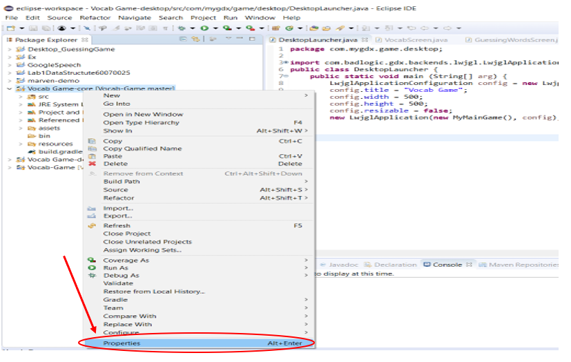</a>
- จะได้หน้าต่างดังรูปแล้วคลิกที่ Java Build Path เสร็จแล้วเลือก Add External JARs จากนั้นกด Apply and Close <br>
<a href=""></a>
- จะขึ้นหน้าต่างดังรูปจากนั้นให้เรากด Open ไฟล์ทั้งหมดในโฟล์เดอร์<br>
<a href="">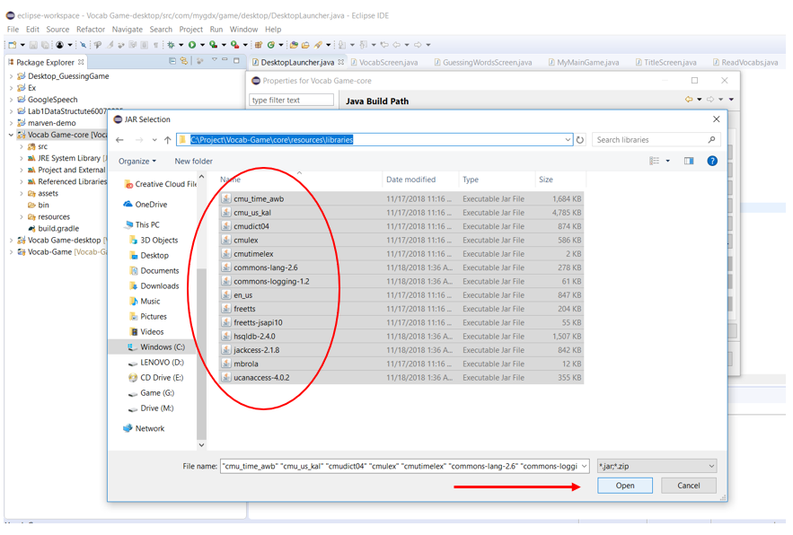</a>
- ทำตามขั้นตอนเดิมที่โฟลเดอร์ Vocab-Game-desktop (เพื่อ add library) จากนั้นจึงสามารถเปิดเกมส์ได้ <br>
<a href="">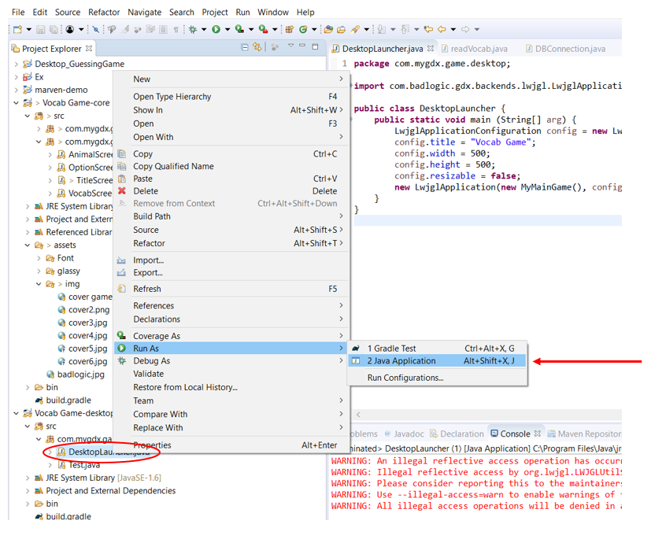</a>
- เมื่อกด Java Application แล้วจะปรากฏหน้าต่างเกมส์ขึ้นมาดังรูป จากนั้นคลิกที่ปุ่ม Start เพื่อเริ่มเกมส์หรือปุ่ม Exit เพื่อออกจากเกมส์ <br>
<a href="">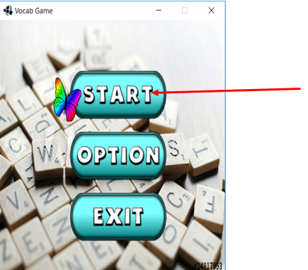</a>
- หลังจากกด Start มาแล้วจะมีหมวดหมู่คำศัพท์ให้เราเลือกเล่น ให้เราเลือกหมวดใดหมวดหนึ่งเพื่อเล่นเกมส์ <br>
<a href="">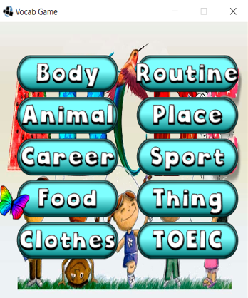</a>
- เมื่อเลือกหมวดคำศัพท์ที่จะเล่นแล้ว จะปรากฏหน้าต่างดังรูป ให้เรากดเลือกคำศัพท์ที่ถูกต้องได้เลย <br>
<a href="">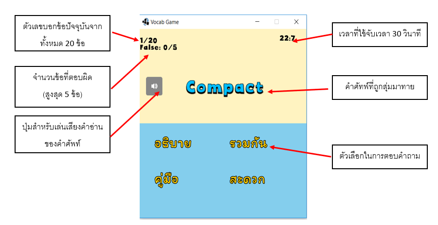</a>
- ถ้าตอบถูกจะขึ้นหน้าต่างแสดงว่า Correct ให้เรากด OK เพื่อไปข้อต่อไป <br>
<a href="">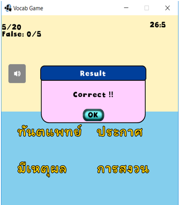</a>
- ถ้าตอบผิดจะขึ้น Wrong ให้กด OK เพื่อเล่นข้อถัดไป <br>
<a href="">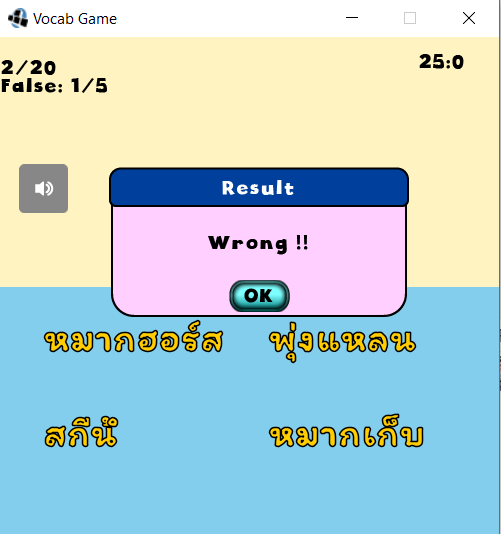</a>
- ถ้าเราตอบผิดเกินที่เราตั้งค่าไว้เกมส์จะจบทันที พร้อมเฉลยข้อที่เราทายผิดเราสามมารถเลือกกดเกมส์เพื่อเล่นอีกครั้งหรือกดออกจากเกมส์เมื่อเลิกเล่นแล้ว <br>
<a href="">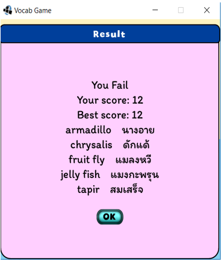</a>
- ได้มีการเพิ่ม score สามารถดูได้ว่าเราได้คะแนนเท่าไหร่แล้ว แล้ว Best score คือเท่าไหร่ถ้าตอบผิดไม่เกินที่เรากำหนดไว้ก็จะขึ้นว่า Win<br>
<a href="">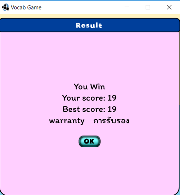</a>
- ได้มีการเพิ่มปุ่ม Option ขึ้นมาสามาถแก้ไขปรับปรุงได้ตามที่เราต้องการ โดยส่วนที่เราแก้ไขได้มีดังนี้	<br>
<a href="">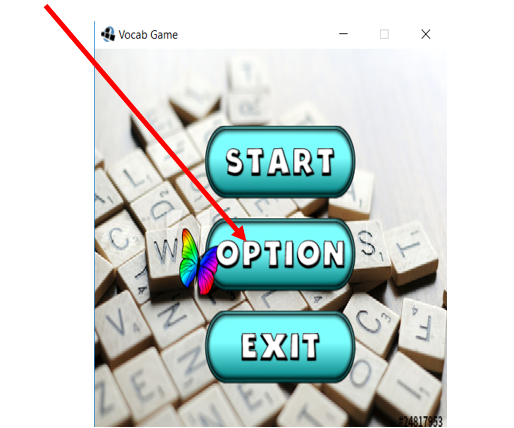</a>
- สามารถเลือกได้ว่าจะทายคำศัพท์กี่ข้อในแต่ละหมวด โดยมีให้เลือกตั้งแต่10ถึง40ข้อ<br>
<a href="">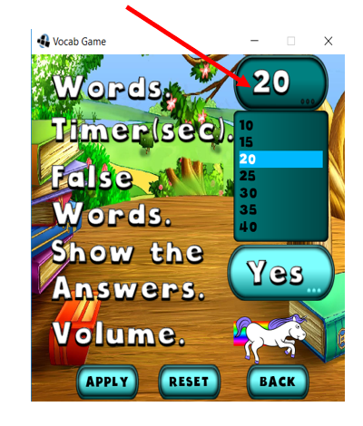</a>
- สามารถเลือกเวลาที่จะทายคำศัพท์ในแต่ละข้อได้ โดยมีให้เลือกตั้งแต่10-30วินาที <br>
<a href="">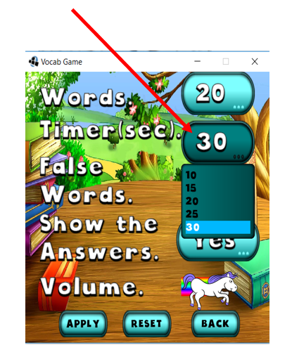</a>
- สามารถเลือกได้ว่าจะทายผิดได้ไม่เกินกี่ข้อในแต่ละหมวด โดยสามารถเลือกได้ตั้งแต่1ถึง5ข้อ <br>
<a href=""></a>
- สามารถเลือกได้ว่าเราจะดูเฉลยได้เลยหรือเลือกที่จะปิดเฉลยเพื่อหาคำตอบเองก่อนได้ <br>
<a href="">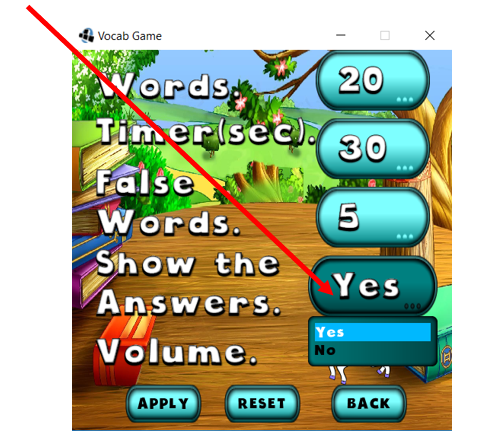</a>
- สามารถเลือกได้ว่าปรับระดับเสียงดนตรีขณะเล่นเกมส์ได้ <br>
<a href="">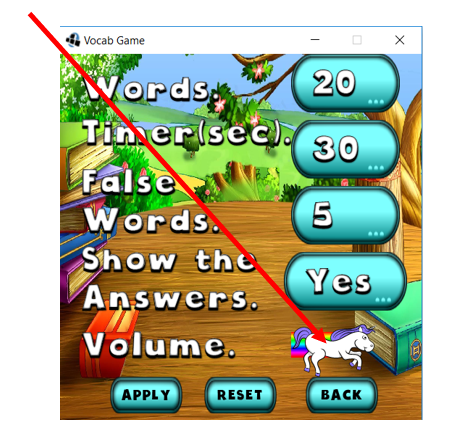</a>
- หลังจากตั้งค่าการเล่นเกมส์ทายคำศัพท์ตามที่เราต้องการแล้วให้กด APPLY เพื่อให้มันบันทึกการตั้งค่าของเรา
จากนั้นจะขึ้นหน้าต่างบอกว่าบันทึกการตั้งค่าสำเร็จดังรูป <br>
<a href="">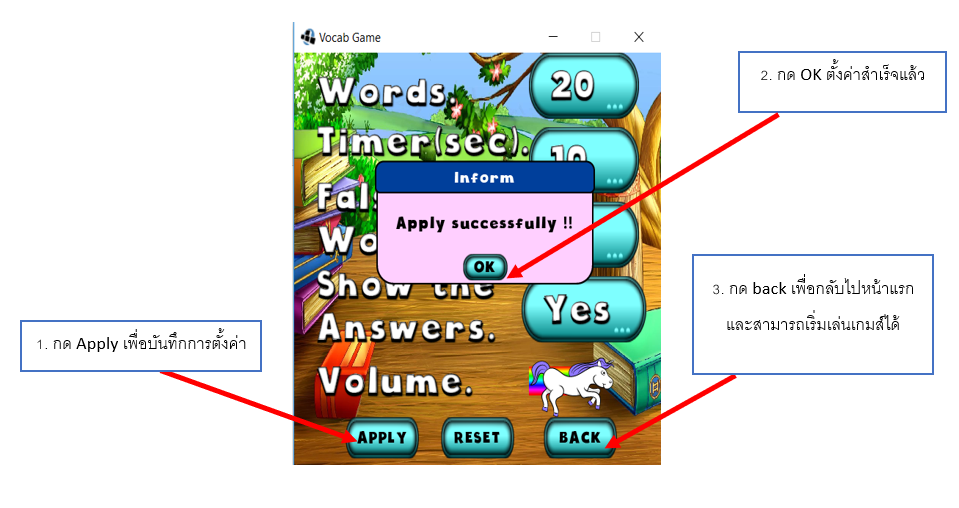</a>
- เราสามารถกด Reset เพื่อกลับไปยังค่าเริ่มต้นของการตั้งค่าตอนติดตั้งเกมส์ได้ <br>
<a href="">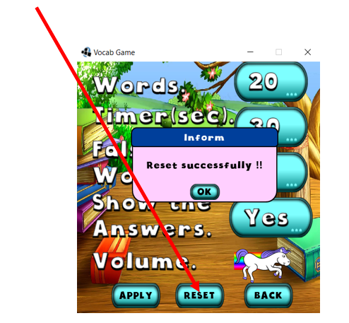</a>
- ทุกๆหน้า สามารถกดปุ่ม Esc เพื่อออกได้ <br>
<a href="">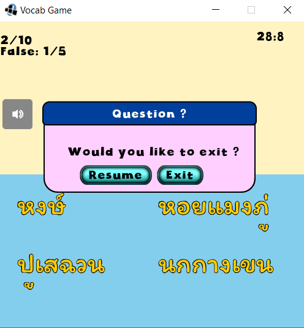</a>

## Team Members
| | รหัสนักศึกษา        | ชื่อ | นามสกุล | githup |
|:-:| :-------------: |:----------:|:--------:|:--------:|
| <a href=""></a> | 60070018    | นายฐิติกร  | ผดุงเวทสวัสดิ์  | https://github.com/maxlunla  |
| <a href=""></a> | 60070024     | นางสาวณัฐปภัสร์  | อยู่ยง  | https://github.com/Nutpapat  |
| <a href=""></a> | 60070025    | นายณัฐวุฒิ  | เตชะศรีบูรพา  | https://github.com/Frong-nt  |

## Assistant Teacher
- Instructor : ผศ.ดร.ธนิศา นุ่มนนท์
<br>&nbsp;&nbsp;&nbsp;&nbsp;&nbsp;&nbsp;&nbsp;&nbsp;&nbsp;&nbsp;โครงการนี้เป็นส่วนหนึ่งของวิชาการสร้างโปรแกรมเชิงอ็อบเจกต์ 
ภาคเรียนที่ 1 ปีการศึกษา 2561<br>สถาบันเทคโนโลยีพระจอมเกล้าเจ้าคุณทหารลาดกระบัง

